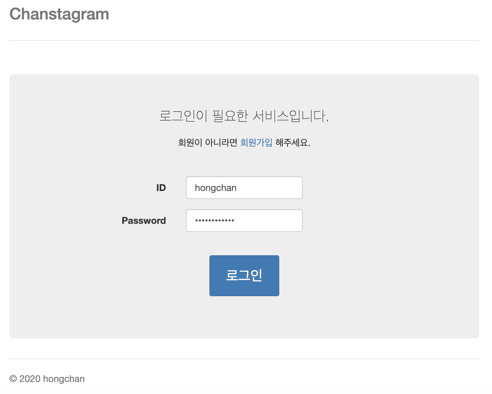
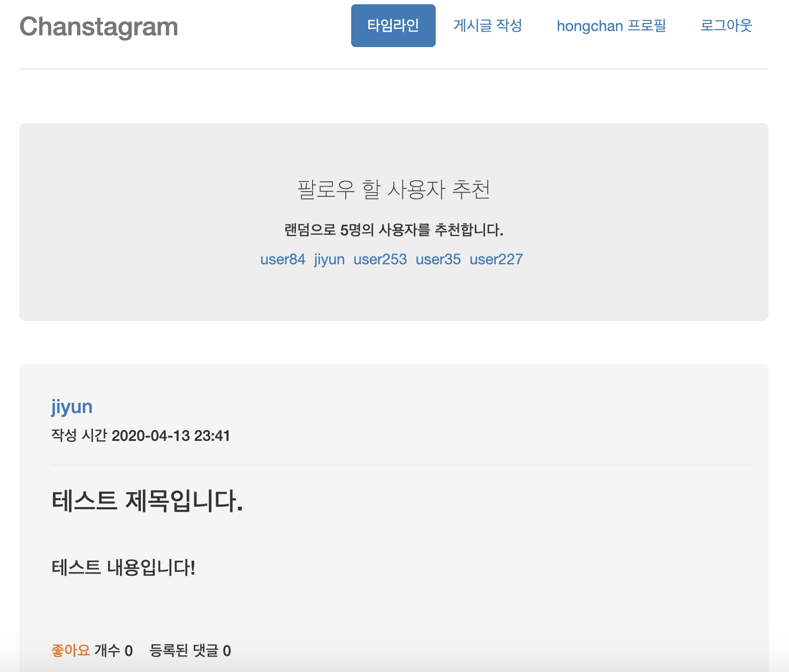

## 타임라인 SNS 서비스 (chanstagram)

**인스타그램과 유사한 기능을 가진 웹 어플리케이션을 구현하여 Spring Framework 학습**

 

- **기능**
  - 로그인, 회원가입
  - 게시물 upload
  - 팔로우 (구독)
  - 팔로우 할 사용자 추천
  - 타임라인
  - 좋아요, 댓글 - 구현 예정

 

- **기술 스택**
  + JAVA
  + Spring boot
  + Spring Security
  + Spring Data JPA
  + RDBMS (h2)
  + Thymeleaf
  + HTML, CSS, Javascript, jQuery, Bootstrap

 

+ **개발 환경**
  + macOS Catalina (10.15.4)
  + IntelliJ IDEA IDE

 

- **스크린샷**

  </img>
  
    
  
   
  
  </img>

---

> 2020.04.13 최종 업데이트
>
> 광운대학교 소프트웨어학부 윤홍찬

